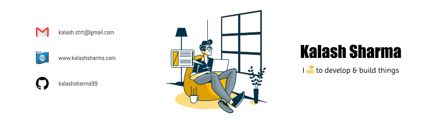

<!-- personal banner -->

 
<!-- greetings -->

## Bonjour! 🐱‍👤

 

<!-- social links -->

 
<!-- about me -->

## About Me 😄

 

**Welcome to my profile!**

🛡 I'm [Kalash Sharma](https://www.kalashsharma.com), a self-taught developer and Computer Science Student.  
🎯 I am passionate about Open Source, Web Development, DevOps, Artificial Intelligence & I also 💛 to learn new things.

**Talking about personal stuff:**

- 💡 I'm currently working on some cool side projects!
- ☘ I'm currently improving my data structures & algorithms concepts.
- 📡 How to reach me: [Mail Me](mailto:kalash.strt@gmail.com)
- 🤝I'm looking for help with **NextJS**
- 😀 Pronouns: he/him

 
 

## Tools & Technology 🛠

|                       |                                                                                                                               |                                                                                                                                                   |                                                                                                                              |                                                                                                                            |                                                                                                      |     |     |     |     |     |     |     |
| --------------------- | ----------------------------------------------------------------------------------------------------------------------------- | ------------------------------------------------------------------------------------------------------------------------------------------------- | ---------------------------------------------------------------------------------------------------------------------------- | -------------------------------------------------------------------------------------------------------------------------- | ---------------------------------------------------------------------------------------------------- | --- | --- | --- | --- | --- | --- | --- |
| Programming Languages |                                  |                                             |  |    |
| Languages             |                      |                                             |            | 
| Databases             |                |                                             |                     |
| Libraries             |                  |
| Frameworks            |          |                       |     |                     |  |
| Hosting               |              |                                       |
| IDEs/Editors          |  |  |                           |
| Testing         |                                                |
| Tools                 |                   |                                                |                  |

 
 

<!-- GitHub Stats -->

  

